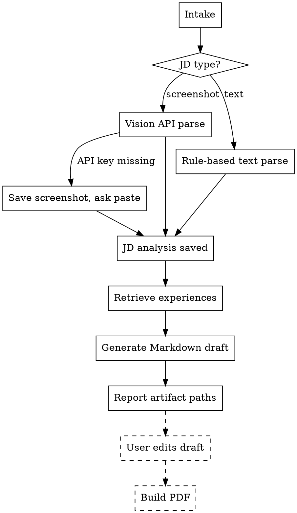

# Resume Tailor

Turn a job description (text or screenshot) into a targeted, optimized resume in Markdown format, ready for manual fine-tuning and PDF export.

**Core principle:** this is a privacy-preserving pipeline. Your real experience database stays local. No fabricated data. The agent acts as a retrieval-and-rendering engine, never as an automatic applicant.

## Non-Negotiables

- **NO FABRICATION.** Never invent experience, metrics, company names, school names, certificates, or any personal information. Every bullet in the generated resume must trace to a real experience entry.
- **`needs_verification: true` entries are FORBIDDEN** in the output. The retriever automatically filters them out. Do not override this filter.
- **Never auto-submit** to any job portal or HR system. The skill outputs a Markdown file for human review and a PDF for download only.
- **Never overwrite** a user-edited draft unless the user explicitly asks you to regenerate.
- **No other skills.** When this skill applies, use only `resume-tailor`. Do not invoke additional skills for planning, writing, or dispatch.
- **Screenshot fallback:** if the vision API key is not configured and the user provides a screenshot, save the screenshot to the run directory and ask the user to paste the JD text manually. Do not silently skip or fabricate content.
- **Privacy boundary:** all generated artifacts must live inside a single per-run output directory (`resume_output_<timestamp>/`). Never scatter files in the user's home, Desktop, or project root.
- **The user must manually edit `draft_resume.md` before PDF export.** The PDF is generated from the (potentially edited) Markdown file, not from the internal representation.

## Skill Boundary

- Allowed skills for this workflow: `resume-tailor` only.
- Forbidden: all other skills, even if they appear relevant to planning, dispatch, verification, or writing.

## Required Outcome

The default successful outcome is:
1. A run directory `resume_output_<timestamp>/` containing:
   - `jd_analysis.json` — structured JD analysis
   - `jd_text.md` — raw JD text (extracted from screenshot or pasted)
   - `selected_experiences.json` — matched experiences with scores
   - `draft_resume.md` — editable Markdown resume (awaiting user edit)
2. After user edits `draft_resume.md`:
   - `resume.pdf` — final exported PDF (optional, requires Pandoc + Chrome)

The following are **not** successful completions:
- inline chat summary only
- a resume draft that was never written to disk
- content that includes `needs_verification` entries
- a PDF generated from unedited internal state when the user wanted to review first

## When to Use

Use this skill when the user wants any of the following:

- "根据 JD 截图生成简历"
- "tailor my resume for this job"
- "把这张岗位 JD 图转成匹配简历"
- "生成可编辑 Markdown 简历并导出 PDF"
- "帮我根据这个JD定制简历"
- "帮我做一份匹配这个岗位的简历"

Do **not** use this skill for:
- general resume writing advice without a specific JD
- writing cover letters (unless the user explicitly asks for this in addition)
- job search queries that don't involve tailoring an existing experience database

## Portability

- Does not depend on any companion skill.
- Python runtime required: `>=3.10`.
- PDF export requires Pandoc + Chrome/Chromium/Edge (optional; Markdown output is the minimum viable deliverable).
- Vision API is optional; unconfigured → graceful fallback to manual text paste.

## Workflow Model

```
User presents JD (screenshot or text)
  │
  ├─ Screenshot → jd_image.py (vision API) → jd_text.md + jd_analysis.json
  │                  └─ API unavailable → save screenshot, ask user to paste text
  │
  └─ Text → jd_parser.py (rule-based parse) → jd_text.md + jd_analysis.json
  │
  ├─ retriever.py (5-dimension scoring) → selected_experiences.json
  │
  ├─ md_generator.py → draft_resume.md
  │
  ├─ [USER EDITS draft_resume.md manually]
  │
  └─ build_pdf.sh/ps1 → resume.pdf (optional, user-invoked)
```

## Execution Flow



## Detailed Steps

### Step 1. Intake

- Ask the user for the JD (paste text or provide a screenshot file path).
- If a screenshot path is provided, note it for Step 2a.
- If text is provided, note it for Step 2b.
- Determine the user's name and preferred contact info if not already known.

### Step 2a. Screenshot → Text (Vision API)

- Try to load `VISION_API_KEY` from `.env` (project root or `~/.env`).
- **If configured:** use the vision API (Claude or GPT-4o) to extract text from the screenshot.
  - Save the extracted text as `jd_text.md` in the run directory.
  - Pass the extracted text to Step 3.
- **If NOT configured:** save the screenshot into the run directory for reference.
  - Tell the user: "No vision API key found. Please paste the JD text manually."
  - Accept pasted text and save as `jd_text.md`.

### Step 2b. Text → Structured Analysis

- Run `parse_jd()` from `jd_parser.py` on the JD text.
- Output `jd_analysis.json` — structured analysis with:
  - job_title, company (optional)
  - hard_requirements (with must_have flags)
  - soft_skills
  - keywords (categorized)
  - pain_points
  - weights (auto-inferred by role type)
- Save `jd_analysis.json` in the run directory.

### Step 3. Retrieve Matching Experiences

- Run `retrieve()` from `retriever.py` (5-dimension scoring: tag match, hard requirement match, industry relevance, evidence quality, recency).
- Filter: `needs_verification: true` entries are **always excluded**.
- Output `selected_experiences.json` with scores and match details.

### Step 4. Generate Markdown Draft

- Run `generate_markdown()` from `md_generator.py`.
- Group experiences by category: education → project → internship → work → certification → skill.
- Output `draft_resume.md` in the run directory.

### Step 5. Report and Wait for User Edit

- Report the paths of all generated files.
- Explicitly tell the user: "Please review and edit `draft_resume.md` to add personal touches, adjust wording, and fill in contact info. Then run the PDF build script to export."

### Step 6. PDF Export (User-Initiated)

- The user runs `build_pdf.sh` or `build_pdf.ps1` on the (possibly edited) `draft_resume.md`.
- The script uses Pandoc + Chrome/Chromium/Edge headless to produce `resume.pdf`.

## Output Naming Rules

- Run directory: `resume_output_<YYYYMMDD_HHMMSS>/` under the project root.
- Content files within the run directory:
  - `jd_analysis.json`
  - `jd_text.md`
  - `selected_experiences.json`
  - `draft_resume.md`
  - `resume.pdf` (after user-initiated build)
  - Screenshot copy if vision API was used.

All generated artifacts must live **inside the run directory**. Never write output files to the project root, user Desktop, or current working directory.

## Privacy Safeguards

- The experience database is **never** uploaded or shared. All processing is local.
- The API call to the vision provider sends only the screenshot, never the experience database.
- `needs_verification: true` entries are forcibly excluded from all output.
- To check for accidental leaks, run `scripts/privacy_check.sh` before publishing any generated resume.

## Common Failure Modes

- fabricating experience or metrics when the user's database lacks relevant entries
- including `needs_verification` entries in the output
- overwriting a user-edited `draft_resume.md`
- claiming completion without writing output files to disk
- forgetting to tell the user they need to edit the draft before PDF
- trying to generate a PDF without checking for Pandoc/Chrome availability
- scattering output files instead of keeping them in the run directory
- silently skimming past a missing vision API key and using a low-quality fallback
- calling other skills for planning or writing help

## Rationalization Table

| Excuse | Reality |
|--------|---------|
| "The experience database doesn't have a perfect match, so I'll adjust some numbers" | Never fabricate or modify experience data. |
| "This `needs_verification` entry looks credible, I'll include it" | The filter exists for a reason. Never override it. |
| "I'll just generate a quick inline summary instead of files" | The deliverable is files in a run directory. |
| "The user probably doesn't want to edit the draft" | Always ask. Never skip the human review step. |
| "I'll call another skill to help with writing" | Only `resume-tailor` is allowed. |
| "The screenshot extraction failed but I can guess the content" | Ask the user to paste the text instead. Do not guess. |
| "I can reuse the previous run's output directory" | Every run gets its own timestamped directory. |

## Red Flags

- fabricated experience entries
- `needs_verification` entries in output
- output written outside the run directory
- no `draft_resume.md` file created
- claiming completion without saved files
- skipping the "ask user to edit" step
- calling additional skills
- screenshot provided but no fallback to manual paste
